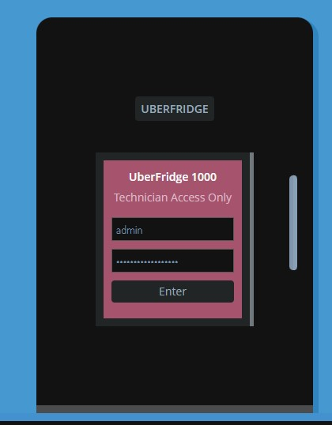
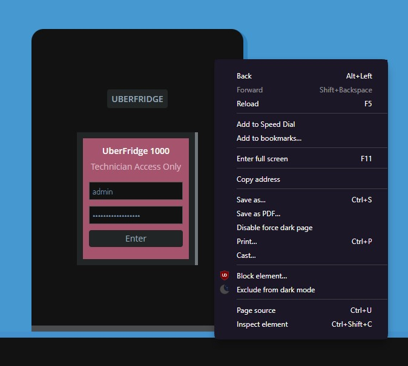
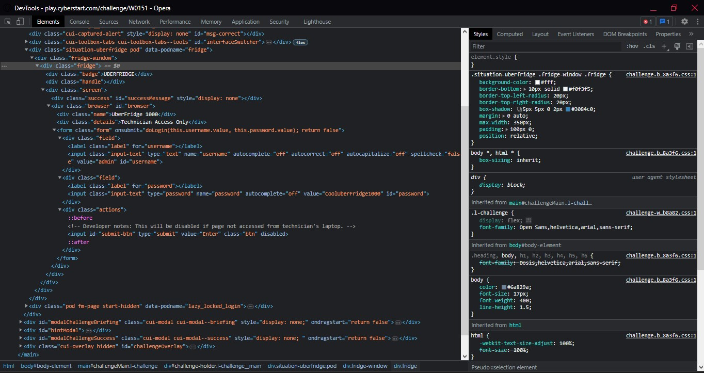
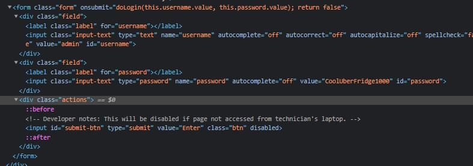
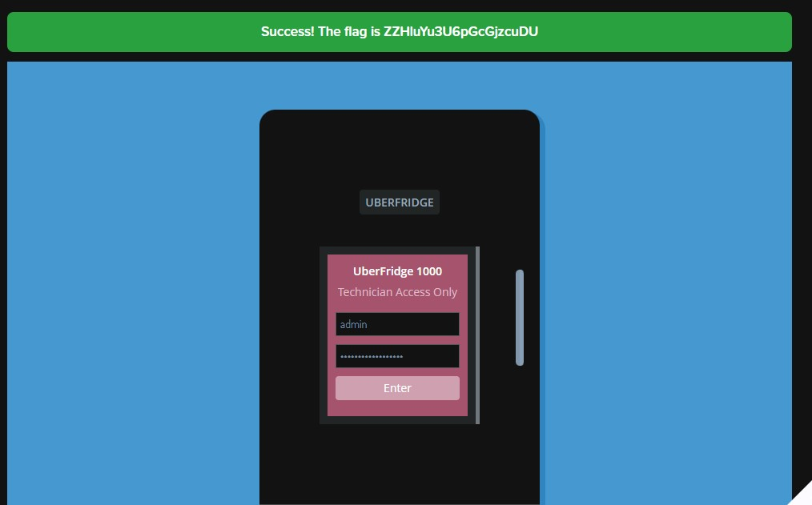

```
Our Dutch office recently bought a new Internet of Things (IoT) connected fridge. However, the temperature settings have been widely fluctuating as of late. All agents are currently out in the field and too busy to fix the problem.

We know there is a remotely accessible technician's page where fridge settings can be modified, and that the fridge's login page isn't very secure. It was easy enough to find the username and password, but the form still has some very lazy extra protection. Intern, can you see if the rumours are true, fix our fridge, and help us verify this reported security vulnerability?

Tip: Successfully login to get the flag.
```

Congratulations, you've almost made it to the end of Level 1! Now, let's see if you can clear this final challenge



Now, our first instincts would be to try and click around the page, see if there is perhaps a hidden password or button that will let us bypass this login page and get the flag. However, it will be to no avail, since the method to solve this challenge is to use your browser's Developer Tools and make some slight changes to the HTML code.

To open the browser Developer Tools (or Dev Tools as I will be calling it from now on), we can right-click on the fridge icon and select "Inspect Element"




If we zoomed in a little bit more, we would see the HTML code for our login form, and inside it the code for the button (which the cheeky developer disabled)



Now all we have to do is to remove the `disabled` keyword and the button should let us click it...



Flag: ZZHluYu3U6pGcGjzcuDU
<sub>As with the previous challenge, do remember to try this challenge out for yourself so that you understand what is going on. The browser Dev Tools is an important tool for completing CTFs, so be sure to remember the steps to opening it.