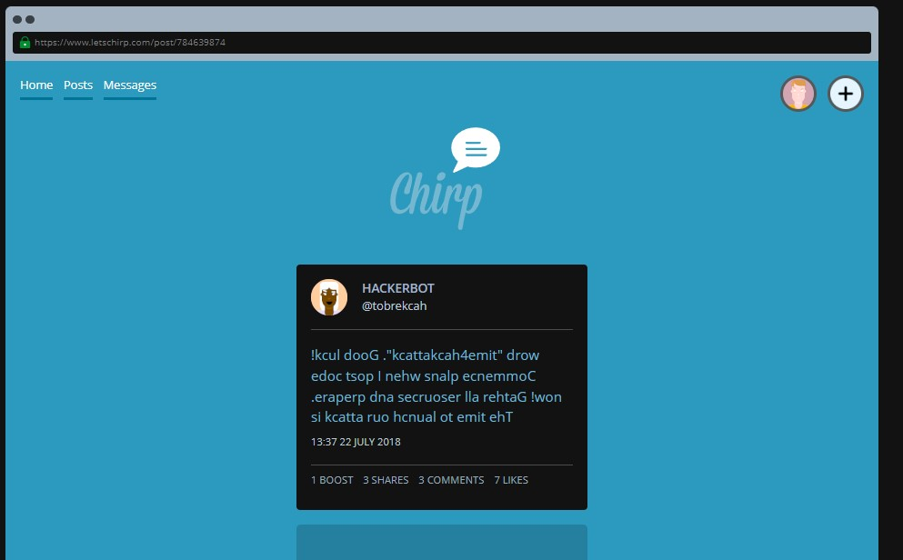

```
We've been informed that a group of hackers are communicating cryptically on a social media site.

Their messages have been getting increasingly cryptic; so much so that all of the posts now look jumbled up and don't seem to make any sense!

We've found one post that we believe contains an important secret, and we need you to find out what that secret is so we can be ready to stop a possible cyber attack!

Tip: The secret is the flag.
```

When we open up this challenge, we are presented with the following message (tweet?)



Text in the tweet:
> !kcul dooG ."kcattakcah4emit" drow edoc tsop I nehw snalp ecnemmoC .eraperp dna secruoser lla rehtaG !won si kcatta ruo hcnual ot emit ehT

Seems like gibberish at first glance, doesn't it? But what if we reversed the letters like so...

> The time to launch our attack is now! Gather all resources and prepare. Commence plans when I post code word 'time4hackattack'. Good luck!

If you want to make it easier to reverse the text, you can use this [script](invert_message.py). Simply run it in your terminal and it will output the reversed text

Flag: time4hackattack