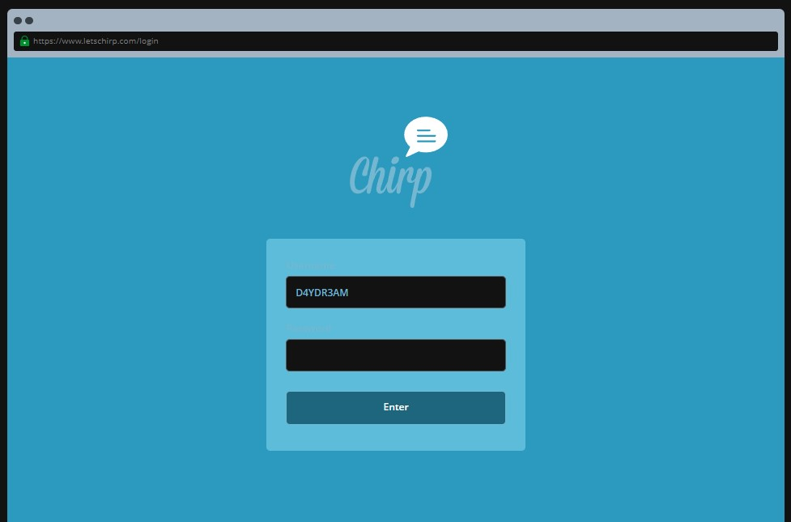
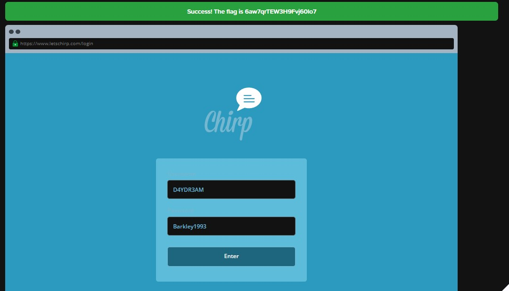

```
Permission has been granted to try and log into the Chirp social media account of a hacker who goes by the name of D4YDR3AM. Luckily for us, they've been clumsy with their personal information. We know their dog's name is Barkley and they were born in 1993. Can you use what we know about them to guess their password and get us into their account?

Tip: Get the flag by guessing the correct password to log into the account.
```

Now, let's open up this challenge and take a look at what we have to work with.



Interesting, it's a login page... but where's the password?

Don't fret, let's look back at the mission briefing and see what information we can work with.

> Permission has been granted to try and log into the Chirp social media account of a hacker who goes by the name of D4YDR3AM. Luckily for us, they've been clumsy with their personal information. We know their dog's name is Barkley and they were born in 1993. Can you use what we know about them to guess their password and get us into their account?

Now, looking at this briefing I can pick out the following information
- 1, they have a pet dog named Barkley
- 2, they were born in 1993

When it comes to setting passwords, most people will rely on easy-to-remember words, phrases or names (such as their loved ones, friends or, you guessed it, their pets). Maybe they want to circumvent the common "minimum 1 digit" requirement for passwords, so the easiest number to remember would most likely be their birthday. With this information in mind, I try typing in "Barkley1993", and sure enough, we get the flag we were looking for



Well that was surprisingly easy. This just goes to show that we should always be careful when we create our passwords. If possible, we should always use password managers that can help us generate highly secure passwords such as "43Fc9Pi9nQQL?5o!" (surely no one can guess this...right?)

Flag: 6aw7qrTEW3H9Fvj60lo7<br>
<sub>Do remember to try this challenge out for yourself so that you understand what is going on