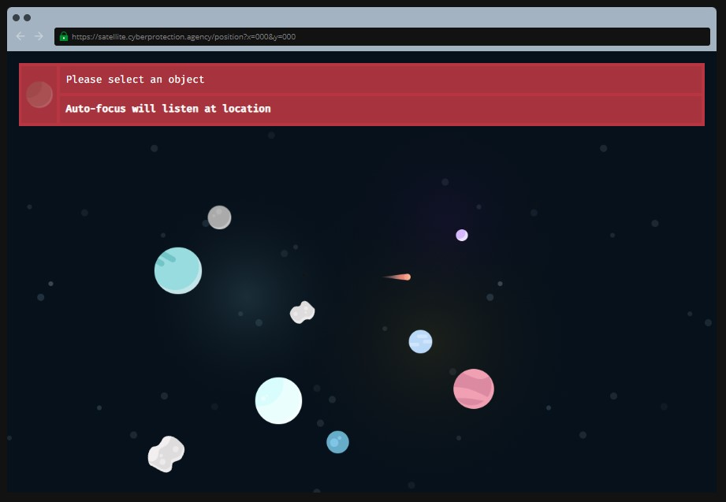
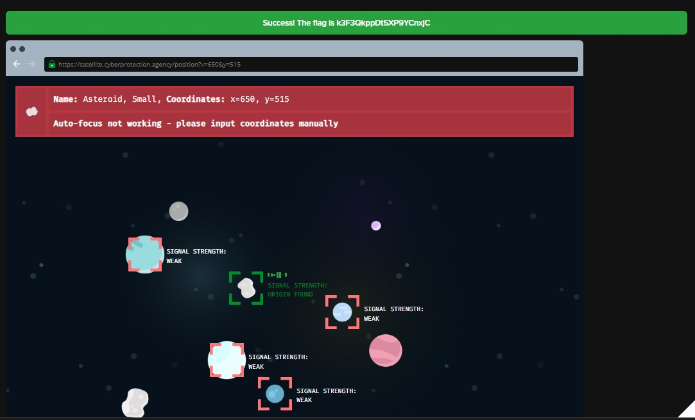

```
The Cyber Protection Agency has launched a satellite into space. Its main goal is to help monitor criminal activities back on Earth... or so we thought. Instead, we’ve detected a strange signal coming from deep space!

Curiosity has got the better of us and we’d like to explore where the signal is coming from. But, the satellite's software isn’t working correctly and we are unable to target objects from the region of space the signal is coming from. Can you find a way around it?

Tip: Try selecting items in the space scene and find somewhere to put the coordinates.
```

Interesting, looks like that satellite we shot up earlier found something... let's take a look, shall we?


<sub> Ooo look, a shooting star! (or a meteor, I guess...)

Interestingly, although the challenge tells us to select the celestial bodies to lock in their coordinates, it seems like there's something wrong with the software. No matter what we do, it seems like there is no way to get the flag, perhaps this challenge is broken?


Before you open a ticket to report this issue, you noticed something interesting with the URL above the big red box<br>
`https://satellite.cyberprotection.agency/position?x=000&y=000`

Hmm, perhaps you can enter the coordinates you saw earlier into the URL itself? You try `https://satellite.cyberprotection.agency/position?x=440&y=445` and get this response


Interesting, interesting... maybe this will work with the other objects too?


<sub>This took longer than I'd like to admit, considering I did this challenge before...

Flag: k3F3QkppDt5XP9YCnxjC