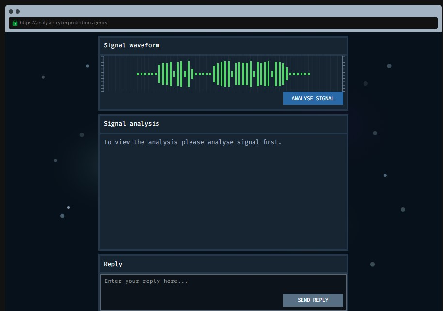
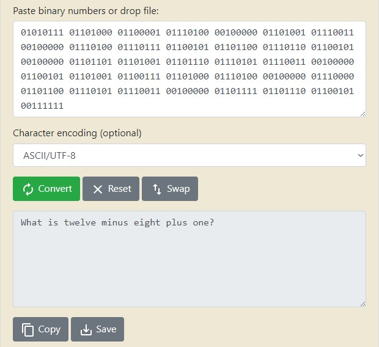
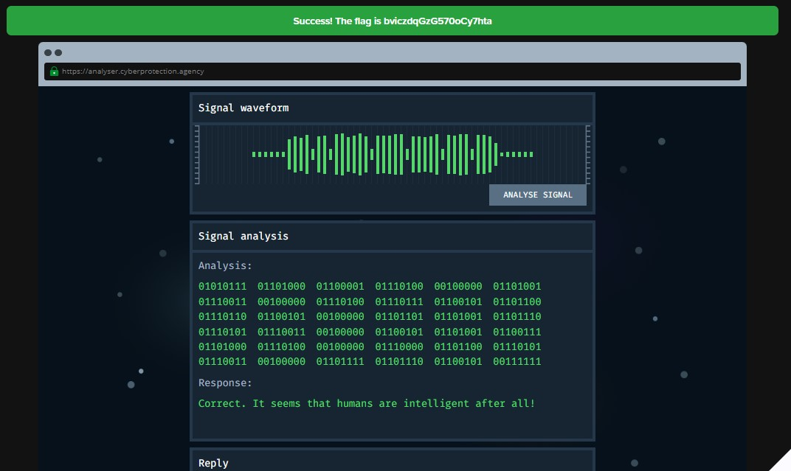

```
Upon locating a strange signal from deep space, agents from the Cyber Protection Agency have been trying to make sense of its output but have failed so far. We think that the output is being encoded using Binary. So, we believe that if we can decode the output we will reveal a hidden message! Can you help us do that?

Tip: Search the Internet for tools that can decode binary.
```
Opening up this challenge, we see this very impressive-looking page



Hitting the "Analyse Signal" button, we get the following response (supposedly from whoever we were contacting)

> 01010111 01101000 01100001 01110100 00100000 01101001 01110011 00100000 01110100 01110111 01100101 01101100 01110110 01100101 00100000 01101101 01101001 01101110 01110101 01110011 00100000 01100101 01101001 01100111 01101000 01110100 00100000 01110000 01101100 01110101 01110011 00100000 01101111 01101110 01100101 00111111

"Well dammit." you say to yourself. "I can't read binary". Just then, you remember that there were a few tools online that you heard someone mention can decode binary. Looking up "binary decoder online" in the Google search engine gives you this as your first <a href="https://www.rapidtables.com/convert/number/binary-to-ascii.html">result</a>. Inputting that weird code you got earlier, you see the following response



Ah that's easy, the answer's 5! Encoding the answer (be sure you use the word 'five', not the number '5') into binary and submitting it as a reply, we get this response.



Flag: bviczdqGzG570oCy7hta