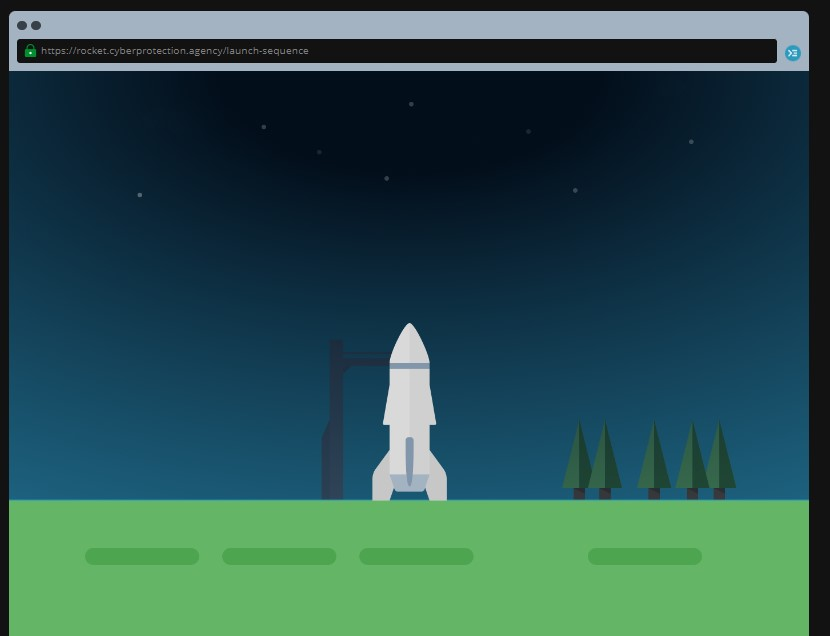
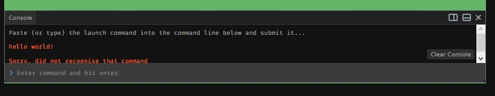
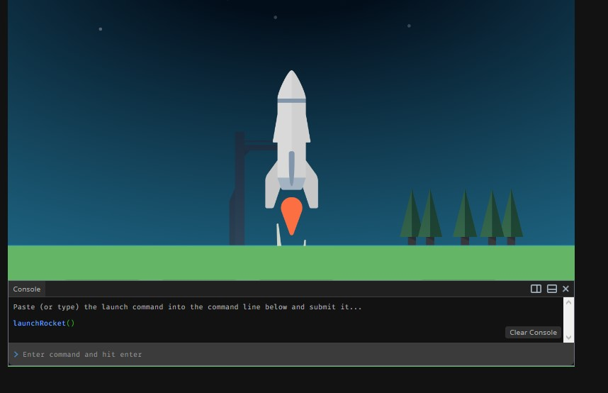
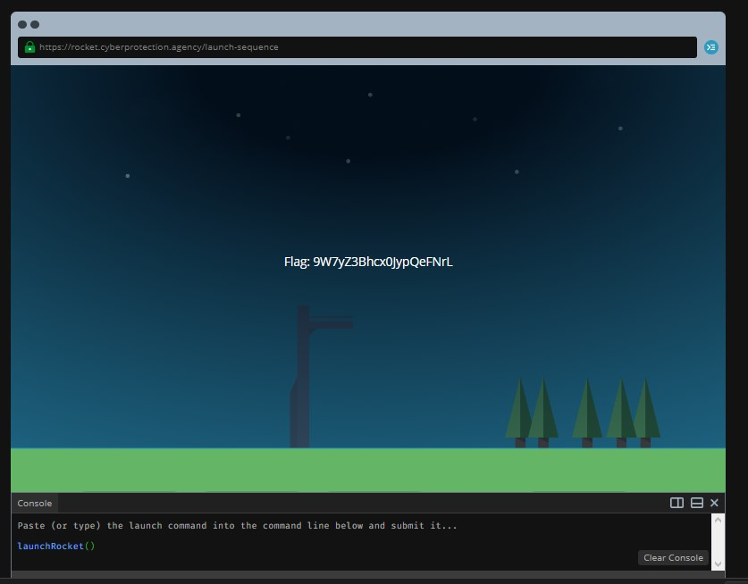

```
We’ve been working with a well-known spaceflight agency to help us launch a satellite into space. The satellite will monitor criminal cyber gangs and help us in our effort of preventing large-scale attacks.

They have given us a command that triggers a launch sequence that will send a rocket with the satellite attached to its destination. The command is launchRocket() Can you figure out how we can run it so we can send this satellite to work?

Tip: You can run JavaScript commands in the Console.
```

Let's open up this challenge and see what we have to work with



We have a small little rocket at the launch pad, but nothing else apart from that. On our top right, we see a little button, which opens up this nice console for us to type commands into


<sub> Aww man, it didn't understand my greeting :(

Looking back at the mission briefing, we see that we have to run ```launchRocket()``` to initiate the blast-off process. Running this code (called a function) in the console gives us this nice animation



And our flag...


Flag: 9W7yZ3Bhcx0JypQeFNrL